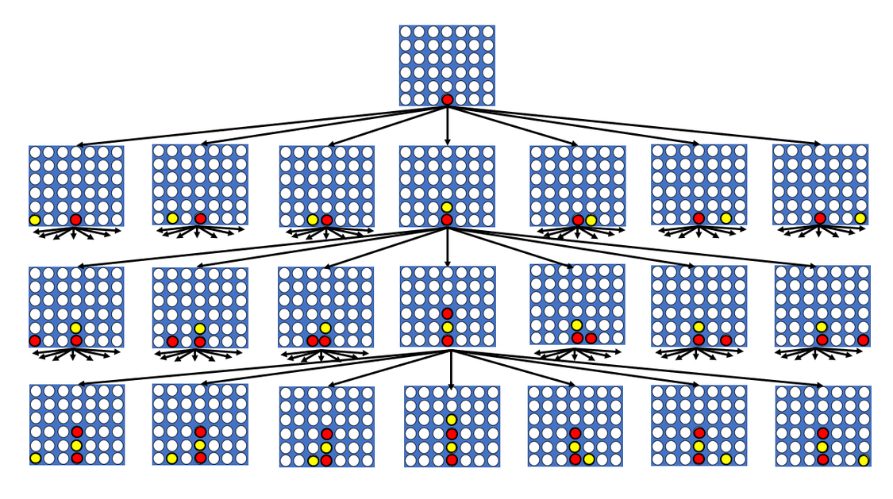
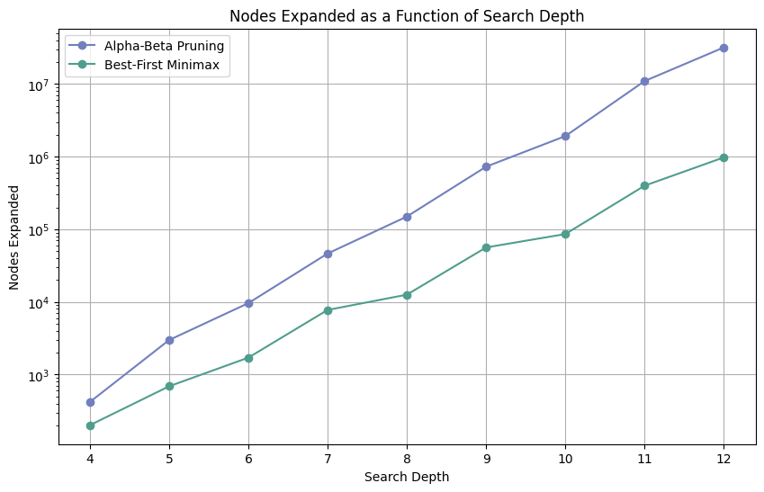
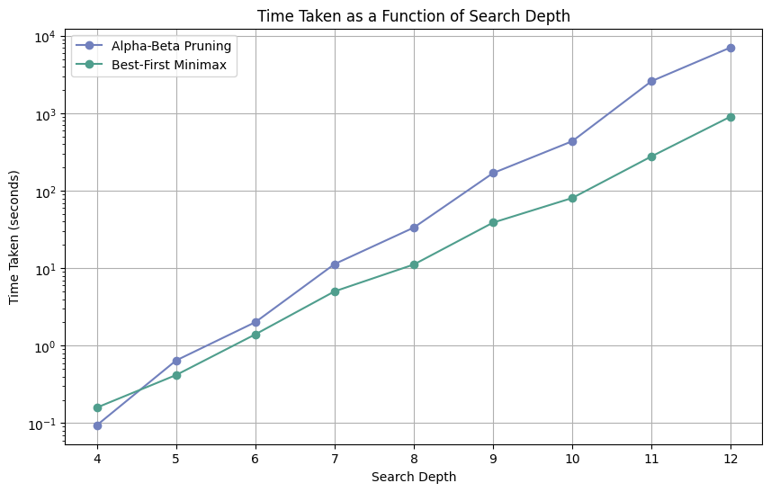

# Connect Four Search Algorithms: Comparative Analysis

_A comparative study of Minimax, Alpha‑Beta Pruning, and Best‑First Minimax for optimal move selection in the Connect Four game._

---

## Project Overview
This project implements three classic adversarial‑search algorithms—**Minimax**, **Alpha‑Beta Pruning**, and **Best‑First Minimax** and benchmarks their performance on the 6 × 7 Connect Four game tree. By replaying identical board states to increasing search depths, we measure each algorithm’s **runtime** and **number of nodes expanded**, revealing how smart pruning and selective expansion can dramatically speed‑up optimal play.

---

## Heuristic Evaluation Function
To avoid traversing the full game tree, all searches rely on a domain‑specific, *consistent* (hence admissible) heuristic that scores every non‑terminal board:

* **Center control** – extra weight for occupying the central column.
* **Line threats** – rewards 2, 3, and 4 in‑a‑row patterns for the current player and penalises the opponent’s threats.
* **Blocking potential** – negative adjustments when the opponent is one move from connecting four, encouraging defensive play.

This heuristic guides both pruning decisions (Alpha‑Beta) and node ordering (Best‑First Minimax), ensuring an informed yet optimal search.

---

## Results at a Glance
* Both enhanced algorithms **find the same optimal moves** as plain Minimax while expanding **orders of magnitude fewer nodes**.
* **Best‑First Minimax** consistently outperforms Alpha‑Beta Pruning:
  * up to ~9× faster at depth 11‑12.
  * up to ~30× fewer nodes expanded at depth 12.

---

## Alpha‑Beta Pruning vs. Best‑First Minimax

| Depth | Runtime BFM (s) | Runtime α‑β (s) | Speed‑up | Nodes α‑β  | Nodes BFM | Node‑Prune Ratio |
| ----- | --------------- | --------------- | -------- | ---------- | --------- | ---------------- |
| 4     | 0.094           | 0.159           | 0.59     | 419        | 201       | 2.08             |
| 5     | 0.646           | 0.419           | 1.54     | 2,988      | 690       | 4.33             |
| 6     | 2.017           | 1.404           | 1.44     | 9,624      | 1,710     | 5.63             |
| 7     | 11.355          | 5.041           | 2.25     | 46,345     | 7,755     | 5.98             |
| 8     | 33.596          | 11.199          | 3.00     | 149,614    | 12,585    | 11.89            |
| 9     | 169.824         | 38.942          | 4.36     | 726,793    | 56,207    | 12.93            |
| 10    | 438.307         | 80.973          | 5.41     | 1,917,360  | 85,945    | 22.31            |
| 11    | 2,612.373       | 279.002         | 9.36     | 10,968,512 | 398,191   | 27.55            |
| 12    | 7,129.182       | 913.469         | 7.80     | 31,849,428 | 975,894   | 32.64            |

The table and two graphs visualize how quickly Best‑First Minimax pulls ahead as search depth grows. While both strategies prune infeasible branches, Best‑First’s targeted expansion of the principal leaf keeps its frontier tiny and search times low.

---

## Key Takeaways
* **Selective expansion matters:** focusing on the most promising branches is even more effective than classic alpha–beta pruning.
* **Heuristics drive performance:** a well‑designed, consistent evaluation drastically cuts search space without sacrificing optimality.
* **Scalability:** Best‑First Minimax enables deeper look‑ahead on modest hardware—vital for complex, real‑time game AI.

Feel free to clone the repo, run the notebook, and plug‑in new heuristics or alternative games to observe how search behaviour changes.

---
